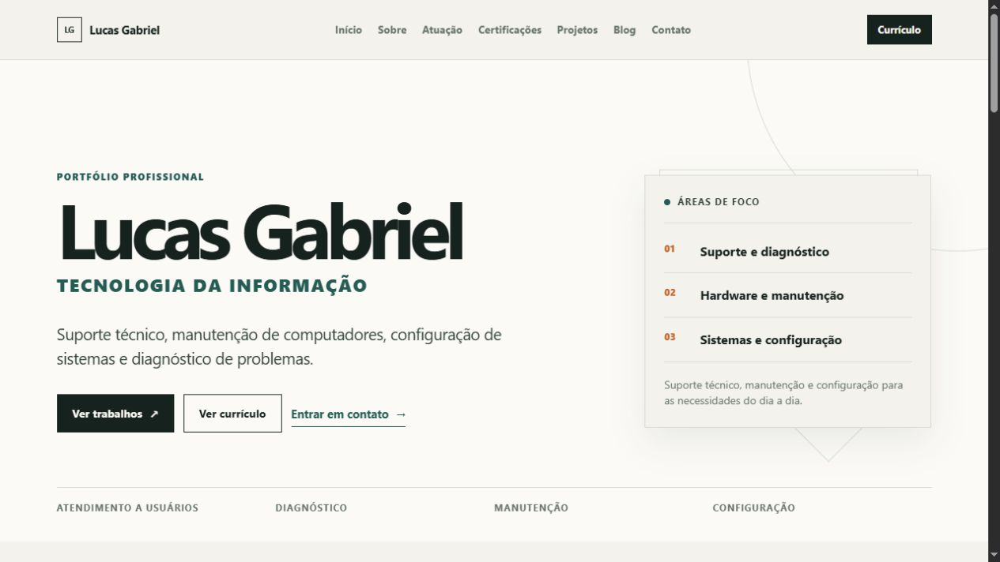
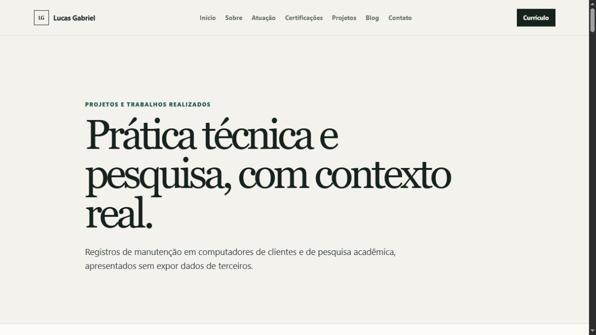
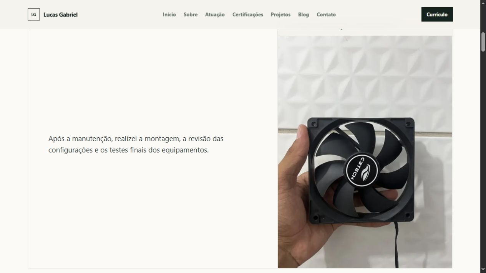

# Portfólio Profissional — Lucas Gabriel

Portfólio profissional voltado à Tecnologia da Informação, reunindo atuação em suporte técnico, manutenção de computadores, configuração de sistemas, formação, certificações, trabalhos e projetos.

## Versão online

[lucas-gabriel-ti.vercel.app](https://lucas-gabriel-ti.vercel.app)

## Tecnologias utilizadas

- Next.js
- React
- TypeScript
- CSS
- Vercel

## O que o site apresenta

- apresentação profissional e áreas de atuação em TI;
- currículo em PDF;
- formação e certificações;
- trabalhos de manutenção com comparativos visuais;
- projeto de pesquisa acadêmica;
- blog profissional e canais de contato.

## Screenshots

### Página inicial

### Projetos e trabalhos

### Trabalho técnico

## Sobre o código

Este repositório apresenta o projeto e seu resultado final. O código-fonte completo é mantido em um repositório privado.
